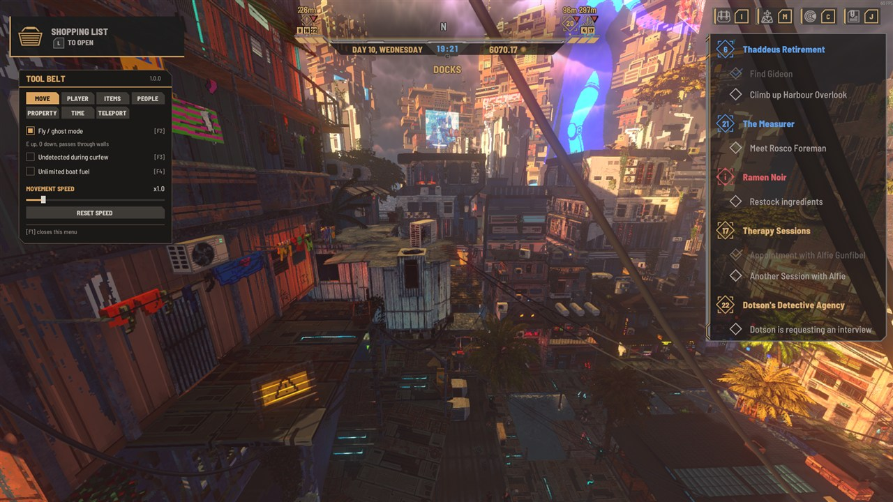
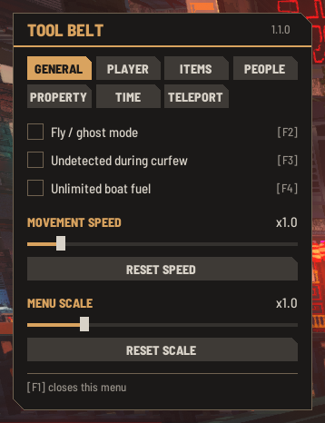
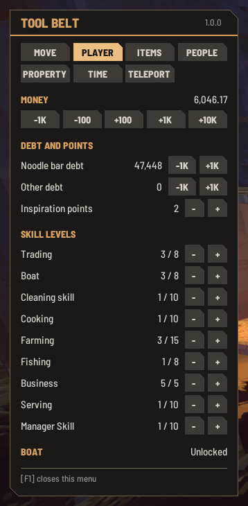
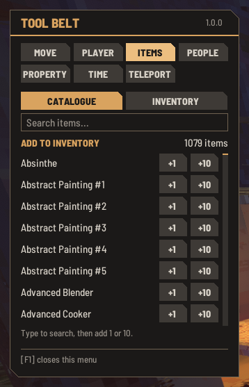
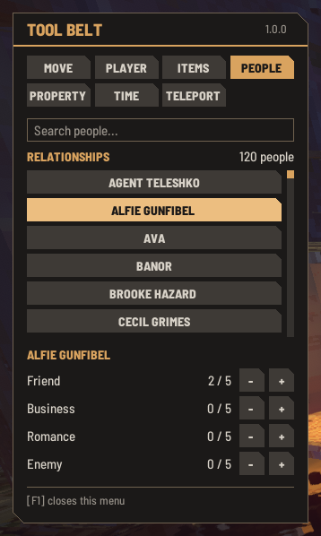
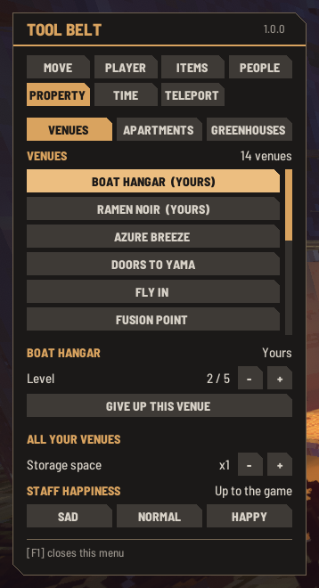
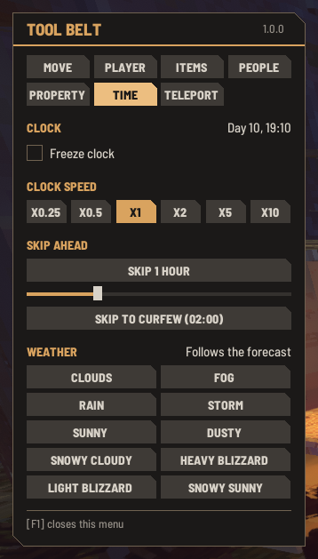
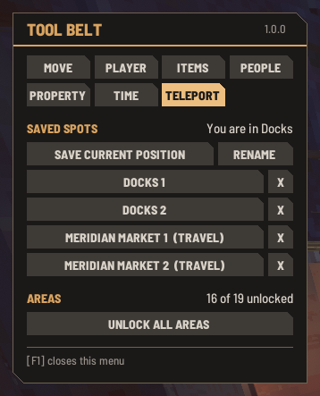

# Nivalis Tool Belt

A multi-tool sandbox mod for Nivalis Nights (BepInEx 6, IL2CPP). Press **F1** in-game to open the menu.



| General | Player | Items | People |
| --- | --- | --- | --- |
|  |  |  |  |

| Property | Time | Teleport |
| --- | --- | --- |
|  |  |  |

The menu has seven tabs.

**General**

| Tool | What it does |
| --- | --- |
| Fly / ghost mode (**F2**) | The game's own no-clip mode: fly along the view direction, **E** up, **Q** down, pass through walls. |
| Undetected during curfew (**F3**) | The curfew's cameras and drones do not notice you. Switching it off during a curfew arms them again at once. |
| Unlimited boat fuel (**F4**) | Keeps the boat's tank full. |
| Movement speed | Multiplier for walk, sprint and fly speed (x0.5 to x5). |
| Menu scale | Size of the menu, x0.5 to x3 (x1 is normal), for large or high-resolution screens. Applied when you let go of the slider and kept between sessions. |

Leaving fly mode with no ground underneath (over water, inside a building) would drop you out of the
world, so the mod puts you back on the last spot you stood on.

The switches (these, instant growth, held weather and held staff happiness) are all off again after
a restart. A hotkey pressed with the menu closed shows a short notice of what it switched.

**Player**

| Tool | What it does |
| --- | --- |
| Money | Add 100, 1,000 or 10,000, or remove 100 or 1,000. Added without a receipt, so it does not show up in the end-of-day balance. Never goes below zero. |
| Skill levels | **-** and **+** for each skill (Trading, Boat, Cleaning, Cooking, Farming, Fishing, Business, Serving, Manager). Each click moves the skill to the start of the previous or next level. |
| Debt | Lower or raise the noodle bar debt and the other debt in steps of 1,000. Never goes below zero. |
| Inspiration points | **-** and **+** for the points recipes are unlocked with. |
| Unlock the boat | Sets the boat to unlocked if it is not yet. This skips whatever the story does to unlock it and cannot be undone from the menu. |

**Items**

| Tool | What it does |
| --- | --- |
| Search | Type part of a name to narrow the list of about 1,080 items. While the search box is active the game's own hotkeys are switched off; Enter, Escape or a click elsewhere leaves it. |
| Catalogue: **+1** / **+10** | Adds the item to your inventory. The line under the list says what was added, or that it did not fit. |
| Inventory: **-1** / **All** | Lists what you carry with its count and removes one or all of an item. Removed items are gone for good. |

About a third of the catalogue (mostly furniture) shares its name with other variants. Those carry
the furniture style in brackets where that tells them apart, otherwise a number ("Abstract Painting #2").

**People**

| Tool | What it does |
| --- | --- |
| Search and list | The 120 story characters, the ones you have met first. Click one to select them. |
| Friend / Business / Romance / Enemy | **-** and **+** for each of the four relationship levels (0 to 5) with the selected character. |

Relationship levels feed into the story, so changing them can open or close dialogue options.

**Property**

Three lists: venues, apartments and greenhouses, each with yours first.

| Tool | What it does |
| --- | --- |
| Venues | Your venues and the ones the game lets the player acquire. Venues run by other owners are not listed. |
| Venue level | **-** and **+** for the level (1 to 5) of a venue you hold. |
| Apartments, greenhouses | The apartments meant for the player and all greenhouses. |
| Rent | Starts renting an apartment or greenhouse. The game charges the daily rent as usual. |
| Take over for free | Makes it yours as a purchase. Your money balance is left as it was. |
| Give up | Hands it back, again without touching your balance. Not offered for your starting venue or your only apartment. |
| Storage space (venues) | Multiplies the storage of every venue you hold, x1 to x10. This one is remembered between sessions; items stored beyond the normal space stay, but nothing more fits until the multiplier is back. |
| Staff happiness (venues) | Holds all staff of your venues at Sad, Normal or Happy. "Leave it to the game again" gives everyone back the mood they had. |
| Instant growth (**F6**, greenhouses) | Everything planted in your greenhouses is ready to harvest at once. |

These go through the game's own ownership handling, but they skip its purchase flow, so anything
the story ties to buying a place does not happen. Try it on a spare save first.

**Time**

| Tool | What it does |
| --- | --- |
| Freeze clock | Stops the in-game clock. |
| Clock speed | How fast the in-game clock runs, x0.25 to x10. Only the clock changes, not the game speed. Resets to x1 when the game restarts. |
| Skip 1 hour / Skip ahead to HH:00 | Advances the clock. It never goes back, and a skip stops at the curfew (02:00), where the game ends the day as usual. During the curfew you have to sleep to move on. |
| Weather | Switches to one of the game's ten weather types (sunny, rain, storm, fog, snow, blizzard and so on) and holds it. "Follow the forecast again" hands the weather back to the game. |

**Teleport**

| Tool | What it does |
| --- | --- |
| Save current position | Adds a spot for the area you are in. |
| Spot buttons | Teleport to that spot; **X** deletes it. A spot saved in mid-air switches fly mode on when you arrive. |
| Rename | While switched on, clicking a spot edits its name instead of teleporting; Enter finishes. |
| Unlock all areas | Opens every area for travel, as the story otherwise does one by one. Cannot be undone from the menu. |

The list shows every saved spot, the current area's first. A spot in another area is marked
**(travel)**: clicking it uses the game's own area travel to get there (the usual loading transition,
no cost in money or time) and then moves you to the spot. This also works during the curfew, when the
game itself does not let you leave an area; it stays blocked while you are not in control (cutscenes,
dialogues, the end-of-day screens).

Spots are stored in `<game>\BepInEx\config\renokk.nivalis.toolbelt.spots.txt` (one tab-separated line
per spot).

The mod writes nothing to save files itself, but the game saves whatever state you are in:
skipped time or an odd position ends up in the next save like any other progress.

## Install

1. Install [BepInEx 6 (IL2CPP, x64)](https://builds.bepinex.dev/projects/bepinex_be) into the game folder and start the game once.
2. Download the zip from the [latest release](https://github.com/HiveSolution/nivalis-tool-belt/releases/latest) and extract it into the game folder, so that `NivalisToolBelt.dll` ends up in `<game>\BepInEx\plugins\NivalisToolBelt\`.

The hotkeys (F1 menu, F2 fly, F3 undetected, F4 boat fuel, F6 instant growth), the speed slider range and the menu scale can
be changed in `<game>\BepInEx\config\renokk.nivalis.toolbelt.cfg` (created on first start).

## Build

Needs the .NET SDK (6 or newer) and a game install with BepInEx that has been started once, because
the build references the generated assemblies in `BepInEx\interop`. They are regenerated after every
game update; rebuild after that.

```
dotnet build -c Release -p:Deploy=true
```

`Deploy=true` copies the DLL into the game. The game folder defaults to the path in
`NivalisToolBelt.csproj`; override it with `-p:GameDir="..."` or the `NIVALIS_GAME_DIR` environment variable.

## Layout

- `src/Plugin.cs`: BepInEx entry point.
- `src/Settings.cs`: config entries (hotkeys).
- `src/ToolBeltBehaviour.cs`: hotkeys, cursor handling, IMGUI menu.
- `src/Theme.cs`: the menu's look (generated textures, the game's Barlow Semi Condensed fonts, styles).
- `src/Sandbox.cs`: movement tools (fly, speed, fall rescue).
- `src/Character.cs`: money, debt, inspiration points, skill levels, boat.
- `src/Items.cs`: item search, adding and removing items.
- `src/People.cs`: relationship levels.
- `src/Venues.cs`: venue level, ownership, storage multiplier, staff happiness.
- `src/Toggles.cs`: undetected during curfew, boat fuel, instant growth.
- `src/Estates.cs`: apartments and greenhouses.
- `src/Weather.cs`: weather presets.
- `src/Clock.cs`: clock tools.
- `src/Teleports.cs`: saved spots, area travel and area unlocking.
- `src/SelfTest.cs`: scripted in-game test, only compiled with `-p:SelfTest=true`.

## Testing in the real game

`-p:SelfTest=true` builds a variant that, while `BepInEx\config\toolbelt-selftest.txt` exists
(content: a save name without extension), loads that save from the title screen and writes one status
line per second to `BepInEx\toolbelt-selftest.log` (player state, position, speeds, clock, cursor). In that build F9 takes a screenshot, F11 saves to a
`toolbelt_test` slot and F12 loads it.
`tools\drive.ps1` has helpers to press real keys, click and take screenshots, and refuses to send
input unless the game window is in the foreground. Back up the save folder first, delete the flag
file afterwards, and deploy a normal build again before playing.

## License

Copyright (c) 2026 RenokK. Licensed under [CC BY-NC 4.0](LICENSE.txt). You may share and modify it for noncommercial purposes with attribution; commercial use, including reselling or bundling it into commercial products, is not permitted.
